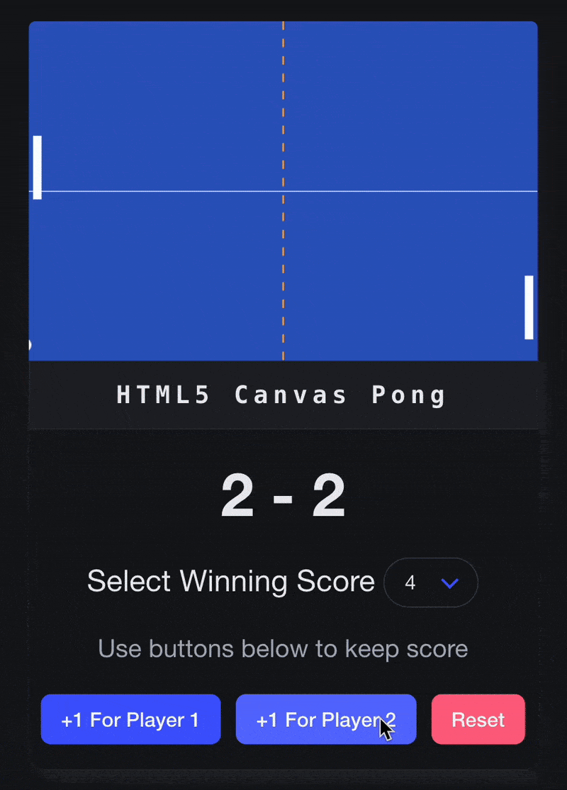

# Canvas Pong 🎾

### [Live Demo](https://canvaspong.vercel.app/)

#### A simple HTML5 canvas ping-pong inspired game with keyboard controls and manual scorekeeping

  
  
  
  

---

  

---

## Features
- Smooth canvas animation using a **fixed timestep** game loop (60 FPS simulation)
- **W** and **S** keys to move your paddle up and down
- AI-controlled opponent paddle
- Manual scorekeeping (+1 buttons for each player)
- Select a winning score before each game
- [Confetti](https://www.npmjs.com/package/canvas-confetti/v/0.4.2) celebration when a player wins!
- Reduced performance notice if the user's FPS drops below 45

## Tech Stack
- HTML5 Canvas API
- Vanilla JS
- CSS3 with Bulma

---

## Project Notes
- This project uses a **fixed timestep accumulator** pattern for consistent physics, even on lower FPS
- FPS is monitored in real-time and a performance notice appears if necessary
